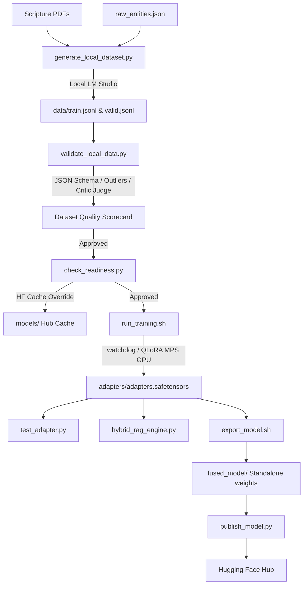

# VidwaanAI Scripture Fine-Tuning Pipeline

An end-to-end, highly optimized local training and validation pipeline designed to fine-tune large language models on scripture commentaries. This workspace is fully containerized via Docker and optimized bare-metal for Apple Silicon macOS (M1/M2/M3 with Unified Memory) using the MLX framework.

The pipeline ingests raw scripture PDFs, semantically intersects text blocks with hierarchical entity ontologies (`raw_entities.json`), generates synthetic instruction tuning datasets, audits dataset quality, executes QLoRA fine-tuning, runs comparative evaluations, integrates with Hybrid RAG architectures, and fuses weights for open-source distribution.

---

## 🛠️ Pipeline Architecture & Flow

---

## 📁 Workspace Map

### Core Components
- **[config.yaml](config.yaml)**: Hyperparameter manifest optimized for Apple Silicon (batch size 1, 8 active layers, gradient checkpointing, rank 8, scale 16, dropout 0.05).
- **[pyproject.toml](pyproject.toml)**: Dependency configurations managing containerization, MLX-LM, Ansible, PyPDF, and ReportLab.
- **[Dockerfile](Dockerfile)** / **[docker-compose.yml](docker-compose.yml)**: Multistage Python slim execution stack separating virtual environments and caching Hugging Face assets.

### Step-by-Step Executables
1. **[init_workspace.sh](init_workspace.sh)**: Environmental health checks and workspace bootstrap diagnostics.
2. **[generate_local_dataset.py](generate_local_dataset.py)**: Extracts scripture text, aligns key terms with the ontology schema, and requests local LM Studio endpoints to generate conversational `.jsonl` fine-tuning sets.
3. **[validate_local_data.py](validate_local_data.py)**: The Validation Gate. Audits JSON structures, filters outliers, scores records via a local Mistral critic judge, and isolates errors in `data/corrupted.jsonl`.
4. **[check_readiness.py](check_readiness.py)**: Ingests model weight configurations, checks memory allocations, and caches models in the local `./models/` folder.
5. **[run_training.sh](run_training.sh)**: Training execution script equipped with an active cgroup/macOS memory watchdog to protect hardware from OOM kernel crashes.
6. **[test_adapter.py](test_adapter.py)**: Command-line interface hosting character-streaming inference and side-by-side un-tuned vs fine-tuned comparative evaluations.
7. **[hybrid_rag_engine.py](hybrid_rag_engine.py)**: Integration wrapper demonstrating retrieval-grounded inference by combining Mock Vector DB search, ontology metadata queries, and local model generation.
8. **[export_model.sh](export_model.sh)**: Fuses LoRA adapter weights natively into base model weights inside `./fused_model/`.
9. **[verify_fused_output.py](verify_fused_output.py)**: Post-fusion gate checks confirming standalone weights load and generate text cleanly.
10. **[publish_model.py](publish_model.py)**: Connects to HF Hub, initializes repositories, and uploads fused models.

---

## ⚡ Quick Start Command Reference

All pipeline steps are orchestrated through the `Makefile`:

### Setup & Caches
- `make init`: Set script permissions and run diagnostic check.
- `make sync`: Synchronize python dependencies via `uv sync` on the host.
- `make build` / `make up`: Build and launch the Docker container stack.

### Pipeline Execution
- `make test-pdf`: Compiles a mock scripture PDF containing ontology names under `data/test_scripture.pdf`.
- `make generate-data-local`: Processes PDFs and queries your local LM Studio instance to write datasets.
- `make validate-data`: Runs structural and semantic QA evaluations on your datasets.
- `make check-readiness`: Ingests model weights and runs pre-flight hardware memory checks.
- `make train`: Runs the QLoRA local training execution loop (saves adapters to `./adapters/`).
- `make test-compare`: Generates side-by-side prompt responses from the base model vs. the fine-tuned adapter.
- `make test-rag`: Executes a retrieval-augmented generation test run combining vector DB contexts.
- `make fuse-model`: Merges weights natively into `fused_model/` in 4-bit format.
- `make verify-fusion`: Compiles and tests the standalone fused weights.
- `make publish`: Uploads the standalone model folder and Hugging Face README Model Card to the Hugging Face Hub.
- `make clean`: Resets the workspace directory (clears locks, generated datasets, adapters, and logs).

---

## 🛡️ Apple Silicon Memory Guardrails

Finetuning large model weights on a single local GPU requires strict resource configurations to ensure OS stability:
- **Gradient Checkpointing (`grad_checkpoint: true`):** Reduces active memory overhead by recalculating tensors during backward passes instead of caching them.
- **Selective Layer Tuning (`num_layers: 8`):** Restricts updates to the top 8 transformer layers to drop activation footprints.
- **Unified Memory Watchdog:** In `run_training.sh`, a background watchdog polls macOS memory pages. If available memory (free + inactive + speculative pages) falls below 1 GB, it sends a `SIGTERM` to the training process, flushing memory allocations safely without file corruption.
